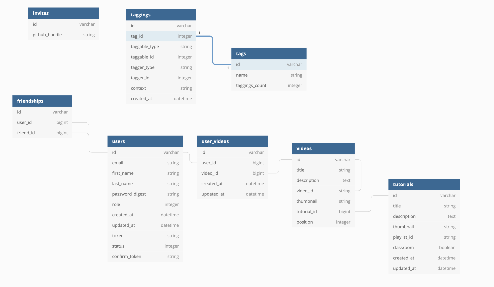

# Brownfield Of Dreams

### About the Project

Brownfield Of Dreams is a Ruby on Rails brownfield project used to organize YouTube content used for online learning. 

We worked for a period of ten days on this paired project to implement new functionalities to the platform: 

* external API consumption (GitHub)
* OAuth functionality (through GitHub)
* email activation of accounts
* email invitation of GitHub users
* bookmarking of video segments
* addition of other users as friends. 

We also set up Continuous Integration using Travis CI. 

Launch the Heroku [app](https://thebrownfieldofdream.herokuapp.com/)


___
### Contributors

[Alexis Dumortier](https://github.com/adumortier)

[Paul Debevec](https://github.com/PaulDebevec) 
___
### Set Up Instructions

First you'll need to setup an API key with YouTube and have it defined within `ENV['YOUTUBE_API_KEY']`. There will be one failing spec if you don't have this set up.

You will also need a GitHub Application `client_id` and `client_secret` and defined them as  `ENV['GITHUB_CLIENT_ID']` and 
  `ENV['GITHUB_CLIENT_SECRET']`.
  
To setup Brownfield Of Dreams locally, run the following commands:

`git clone https://github.com/adumortier/brownfield-of-dreams`

`brownfield-of-dreams`

`bundle install`

`bundle update`

`rails db:{drop,create,migrate,seed}`

Install node packages for stimulus
```
$ brew install node
$ brew install yarn
$ yarn add stimulus
```

Set up the database
```
$ rake db:create
$ rake db:migrate
$ rake db:seed
```

Run the test suite:
```ruby
$ bundle exec rspec
```

Create a new heroku app and connect to your local `BrownFieldOfDreams` repository with:

`heroku git:remote -a your_heroku_app_name`

Deploy `BrownFieldOfDreams` from Heroku.

The original repository of the `BrownFieldOfDreams` project can be found [here](https://github.com/turingschool-examples/brownfield-of-dreams).
___
### Schema Design


___
## Technologies
* [Stimulus](https://github.com/stimulusjs/stimulus)
* [will_paginate](https://github.com/mislav/will_paginate)
* [acts-as-taggable-on](https://github.com/mbleigh/acts-as-taggable-on)
* [webpacker](https://github.com/rails/webpacker)
* [vcr](https://github.com/vcr/vcr)
* [selenium-webdriver](https://www.seleniumhq.org/docs/03_webdriver.jsp)
* [chromedriver-helper](http://chromedriver.chromium.org/)
___
### Versions
* Ruby 2.4.1
* Rails 5.2.0
